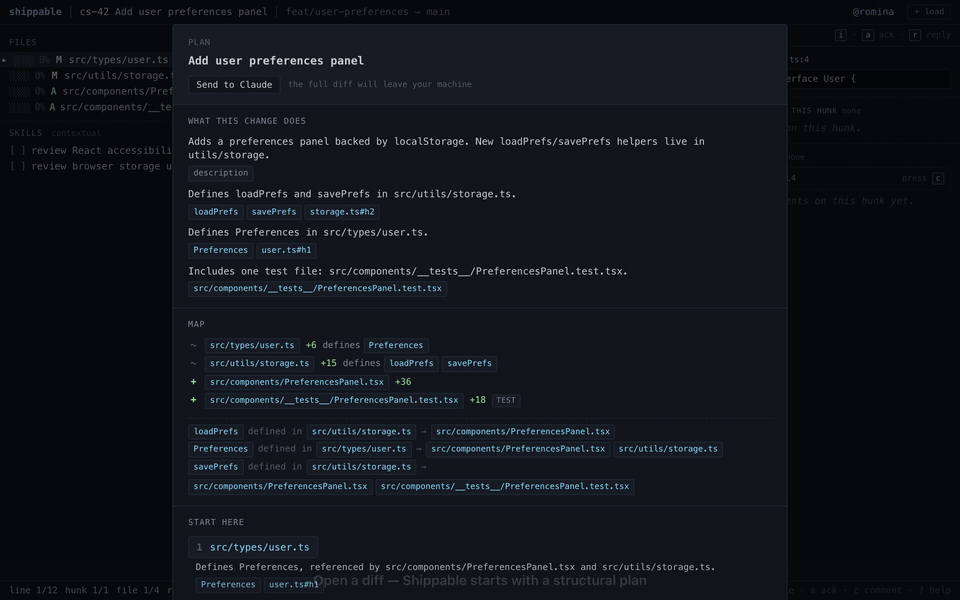

# shippable

Shippable is an early **prototype** of an AI-assisted code review tool that accompanies you as you work through a diff. Shippable helps you figure out where to start, highlights how things relate to each other, and keeps track of you've already reviewed.



The code itself is a throwaway at this point, meant to explore a concept. Please don't use this in any kind of production setting.

## Running it

There are two packages: `web/` (the React app) and `server/` (a tiny Node backend that handles worktree ingestion, the prompt library, and AI-generated review plans). Both are required — the UI shows a “server unreachable” gate at boot if the backend isn’t running.

### Frontend (`web/`)

```
cd web
nvm use           # picks up Node from .nvmrc (22). fnm/asdf read it too.
npm install
npm run dev       # Vite dev server (proxies /api → server on :3001)
npm run build     # tsc -b && vite build — the canonical "did I break typing" check
npm run lint      # eslint
npm run test      # vitest run
npm run preview   # serve the production build
```

### Backend (`server/`)

The backend is required. The web app probes `/api/health` at boot and refuses to load if the server isn’t reachable.

```
cd server
npm install
```

The server boots without an Anthropic key — only AI plan and streaming review need one. Paste your key in the Settings panel (or the first-launch prompt); it's stored in your login Keychain (Tauri) or held in server memory until restart (dev/browser). The legacy `ANTHROPIC_API_KEY` shell export is no longer consulted.

```
npm run dev        # tsx watch on http://127.0.0.1:3001
npm run typecheck  # tsc --noEmit
npm run test       # vitest run
```

#### Optional: enable click-through symbol navigation

The server can resolve go-to-definition against a local checkout per language. Each language module discovers its own LSP independently, so installing one is enough — others can come later. Today: JS/TS via `typescript-language-server` and PHP via `intelephense` (or `phpactor` as a fallback).

1. **Install at least one LSP.** Pick the languages you actually review.

   | Language | Recommended (one-line install)                                       | Alternative                                               | Explicit-path env var               |
   |----------|----------------------------------------------------------------------|-----------------------------------------------------------|-------------------------------------|
   | JS / TS  | `npm install -g typescript typescript-language-server`               | —                                                         | `SHIPPABLE_TYPESCRIPT_LSP`          |
   | PHP      | `npm install -g intelephense`                                        | `composer global require phpactor/phpactor`               | `SHIPPABLE_PHP_LSP`                 |

   A one-shot `npm run setup:lsp` is planned — see [`docs/plans/lsp-setup-script.md`](docs/plans/lsp-setup-script.md). Until that lands, run the install lines you want and restart the server.

2. **Load the diff from a worktree.** Open the worktree picker and pick a checkout — the frontend passes its path to the server. For diffs that don't come from a worktree (pasted, URL-loaded, fixture), set `SHIPPABLE_WORKSPACE_ROOT=/abs/path/to/checkout` before starting the server as a fallback root.

Verify it's working: hit `GET http://127.0.0.1:3001/api/definition/capabilities` — each entry in `languages[]` reports `available`, `resolver` (binary basename), `source` (where we found it), and `recommendedSetup` if it's missing. The diff toolbar shows a per-language chip: `def: TS LSP` / `def: PHP LSP` when ready, `def: TS, PHP only` for a programming language we don't yet support, or no chip at all on non-programming files (markdown, json, yaml).

Current limits — see [`docs/plans/plan-symbols.md`](docs/plans/plan-symbols.md) for the roadmap:

- worktree-backed diffs only (or the `SHIPPABLE_WORKSPACE_ROOT` fallback)
- adding a new language is a single file in `server/src/languages/`; tracked in [`docs/plans/lsp-php.md`](docs/plans/lsp-php.md)
- no browser-only fallback yet (every click goes through the server)

The bundled desktop app reads from the same Keychain entry as the dev server, so this one setup serves both surfaces.

The backend listens on `http://127.0.0.1:3001` and allows these browser origins by default:

- `http://localhost:5173`
- `http://127.0.0.1:5173`

If you want a different browser-origin allowlist, set:

```
export SHIPPABLE_ALLOWED_ORIGINS=http://localhost:5173,http://127.0.0.1:5173
```

The streaming review endpoint is rate-limited per IP. Defaults to 30 requests per minute as a check against accidental/local spam; tune with:

```
export SHIPPABLE_REVIEW_RATE_LIMIT=30
```

#### API surface

The full surface lives in [`server/src/index.ts`](server/src/index.ts). Request/response shapes are TypeScript types in [`web/src/types.ts`](web/src/types.ts) and [`web/src/definitionTypes.ts`](web/src/definitionTypes.ts) — the server imports them directly so they cannot drift from the client.

The endpoints, grouped by feature:

| Method   | Path                              | Purpose                                                                    |
|----------|-----------------------------------|----------------------------------------------------------------------------|
| `GET`    | `/api/health`                     | Liveness check — `{ ok: true }`.                                           |
| `POST`   | `/api/plan`                       | Generate a review plan. `{ changeset: ChangeSet } → { plan: ReviewPlan }`. |
| `POST`   | `/api/review`                     | Streaming review (SSE). Rate-limited per IP.                               |
| `GET`    | `/api/definition/capabilities`    | Whether definition lookup is available + which languages.                  |
| `POST`   | `/api/definition`                 | `{ file, language, line, col, workspaceRoot? } → DefinitionResponse`.      |
| `POST`   | `/api/code-graph`                 | Symbol graph for the touched files in a diff (LSP- or regex-backed).       |
| `GET`    | `/api/library/prompts`            | List shipped prompts.                                                      |
| `POST`   | `/api/library/refresh`            | Re-sync the prompt library. Requires `SHIPPABLE_ADMIN_TOKEN`.              |
| `POST`   | `/api/worktrees/list`             | List git worktrees discoverable from a given dir.                          |
| `POST`   | `/api/worktrees/changeset`        | Build a `ChangeSet` from a worktree at HEAD, a single ref, or a SHA range. |
| `POST`   | `/api/worktrees/commits`          | Recent commits for a worktree (powers the range picker).                   |
| `POST`   | `/api/worktrees/state`            | `(sha, dirty, dirtyHash)` — the live-reload poll baseline.                 |
| `POST`   | `/api/worktrees/file-at`          | Fetch a file's content at a given sha (full-file view).                    |
| `POST`   | `/api/worktrees/graph`            | Repo graph for a worktree at a ref.                                        |
| `POST`   | `/api/worktrees/sessions`         | Claude/Codex session files for a worktree.                                 |
| `POST`   | `/api/worktrees/agent-context`    | Slice of agent context for one commit.                                     |
| `POST`   | `/api/worktrees/pick-directory`   | Native directory picker (sidecar only).                                    |
| `GET`    | `/api/worktrees/mcp-status`       | Whether the shippable MCP server is wired into common harnesses.           |
| `POST`   | `/api/agent/enqueue`              | Enqueue a reviewer comment for the agent to pull.                          |
| `POST`   | `/api/agent/pull`                 | MCP-side: pull pending comments and ack them.                              |
| `GET`    | `/api/agent/delivered?path=…`     | Already-delivered comments for a worktree.                                 |
| `POST`   | `/api/agent/unenqueue`            | Drop a comment by id before delivery.                                      |
| `POST`   | `/api/agent/replies`              | MCP-side: post an agent reply to a delivered reviewer comment.             |
| `GET`    | `/api/agent/replies?path=…`       | Reviewer-side: pull replies the agent posted to delivered comments.        |

The plan model defaults to `claude-sonnet-4-6`; override by setting `CLAUDE_MODEL` in the same shell.

> **Heads-up:** the API surface is currently RPC-style and not stable. We're tracking design issues (HTTP status vs. discriminated `status` field, `path` vs. `worktreePath` body keys, structured error codes for the MCP queue, capability/lookup race) in [`docs/plans/api-review.md`](docs/plans/api-review.md). The frontend is the only client today, so changes don't break a public contract.

Three entry points:

- `/` is the live app.
- `/gallery.html` is a screen catalog that renders every UI state against canned fixtures. This is the intended surface for design work — way faster than driving the live app with the keyboard to reach an edge case.
- `?cs=<id>` on the main app jumps straight to a specific sample ChangeSet, which is handy if you need to reproduce a fixture state manually.

## MCP server

The repo also ships a small TypeScript MCP server at [`mcp-server/`](./mcp-server/README.md) that exposes a `shippable_check_review_comments` tool over stdio. Wire it into Claude Code, Codex CLI, Cursor, or any other MCP-speaking harness, and you can ask your agent `check shippable` to pull pending reviewer feedback from the local server's queue. See `mcp-server/README.md` for per-harness install lines.

## Building the desktop app

Shippable can also ship as a native macOS app. The React frontend gets wrapped in a [Tauri 2](https://tauri.app/) shell, and `server/` gets compiled to a standalone binary via [`bun build --compile`](https://bun.sh/docs/bundler/executables) and bundled inside the .app — so the .dmg is self-contained, no Node or browser dev server required at runtime.

### One-time setup

```
brew tap oven-sh/bun && brew install bun
cargo install tauri-cli --version "^2.0"
npm run desktop:setup
```

### Build

```
npm run build:dmg
```

Output:

- `src-tauri/target/release/bundle/macos/Shippable.app`
- `src-tauri/target/release/bundle/dmg/Shippable_0.1.0_aarch64.dmg`

`npm run build:dmg` is the canonical entrypoint from the repo root. It first runs `cargo tauri build -b app`, and `src-tauri/tauri.conf.json` already wires in the required pre-build steps:

- compile `server/` into the bundled sidecar binary
- build `web/` into `web/dist`

The repo intentionally creates the final `.dmg` with `hdiutil` after Tauri produces the `.app`. Tauri's built-in DMG step relies on Finder AppleScript and is brittle in headless or sandboxed environments.

The .dmg is unsigned, so first launch trips macOS Gatekeeper — right-click the .app in Finder → Open → confirm once. Subsequent launches don't prompt.

To publish a build as a GitHub release, see [`docs/RELEASE.md`](./docs/RELEASE.md).

### First launch

If no Anthropic API key is configured, the app shows a setup modal where you can paste one. The key is stored at `service=shippable, account=ANTHROPIC_API_KEY` in your login Keychain. A successful save takes effect immediately — no relaunch needed. Manage credentials anytime via the topbar settings (⚙) or the Welcome-screen settings link, and skip the prompt with "Skip — use rule-based only" if you only want the rule-based plan.

Remove a saved key from Settings (Clear), or directly with:

```
security delete-generic-password -s shippable -a ANTHROPIC_API_KEY
```

### GitHub Personal Access Token (for PR ingest)

To load a PR by URL, Shippable needs a PAT for each GitHub host you review from.

**Create a token:**
- github.com: `https://github.com/settings/tokens`
- GitHub Enterprise: `https://<your-host>/settings/tokens`

**Required scopes:** `repo` for private repositories. Public PRs work with any valid token — Shippable uses eager-auth (token required before the first API call for a host, even for public repos).

**How it's stored:**
- **Desktop app (Tauri):** macOS Keychain, one entry per host — `service=shippable, account=GITHUB_TOKEN:<host>` (e.g. `GITHUB_TOKEN:github.com`). Persists across restarts.
- **Browser dev mode:** server process memory only. Re-enter the token whenever the server restarts.

The web app never holds the token in `localStorage` or across page reloads — it pushes the token to the local server once, and the server uses it for all GitHub API calls in that session.

**First use:** open LoadModal → "From URL", paste an HTTPS PR URL, and submit. Shippable will prompt for the token if one isn't already stored for that host. For GitHub Enterprise hosts, Shippable first asks you to confirm the host and shows the exact API base URL the token will be sent to. Enter the token once; the desktop app writes it to Keychain automatically.

**Behind a corporate proxy?** Set `HTTPS_PROXY` (or `https_proxy`) before starting the server and Shippable will route GitHub API calls through it. `NO_PROXY` is honored as a comma-separated list of hostnames (exact or `.suffix` match).

Remove a stored token:

```
security delete-generic-password -s shippable -a GITHUB_TOKEN:github.com
```

### Iterating

For quick iteration on the Rust shell or the frontend, `npm run desktop:dev` runs the React app via Vite in a native window with hot reload. The pre-dev hook in `src-tauri/tauri.conf.json` compiles the bundled sidecar first, so you don't need to remember a separate `bun run build:sidecar` step.
