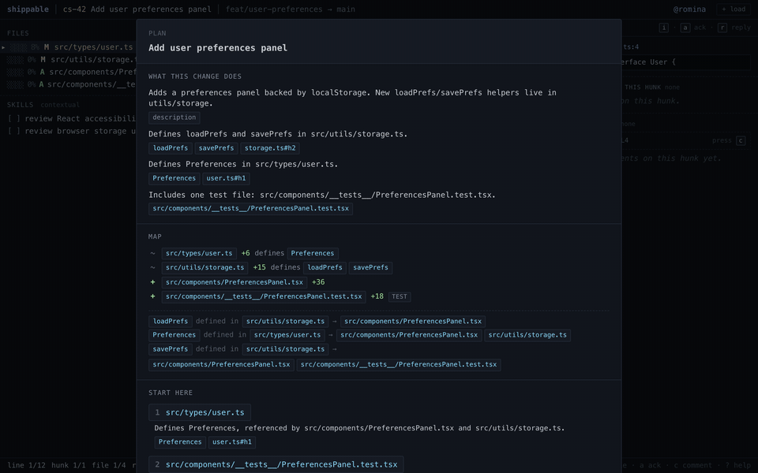

# shippable

Shippable is an early **prototype** of an AI-assisted code review tool that accompanies you as you work through a diff. Shippable helps you figure out where to start, highlights how things relate to each other, and keeps track of you've already reviewed.



The code itself is a throwaway at this point, meant to explore a concept. Please don't use this in any kind of production setting. 

## Running it

There are two packages: `web/` (the React app) and `server/` (a tiny Node backend that calls the Claude API for AI-generated review plans). For the AI plan you need both running; without `server/` the UI falls back to a rule-based plan.

### Frontend (`web/`)

```
cd web
nvm use           # picks up Node from .nvmrc (22). fnm/asdf read it too.
npm install
npm run dev       # Vite dev server (proxies /api → server on :3001)
npm run build     # tsc -b && vite build — the canonical "did I break typing" check
npm run lint      # eslint
npm run preview   # serve the production build
```

There's no test runner wired up yet. `npm run build` is the typecheck for now.

### Backend (`server/`)

The backend is opt-in: if it's not running, the UI shows the rule-based plan and logs a warning. To enable Claude-generated plans:

```
cd server
npm install
```

The server reads `ANTHROPIC_API_KEY` from its environment. On macOS, keeping the key in the system Keychain is a reasonable default: it's encrypted at rest (so a stolen disk without FileVault doesn't leak it) and harder to disclose by accident than a plaintext file. It does *not* protect against malware running as your user — anything running as you can shell out to `security` and read it.

**One-time setup** — add the key to Keychain (the `-w` flag with no value prompts interactively, so the key never lands in shell history):

```
security add-generic-password -a "$USER" -s anthropic-key -w
```

**Each new shell** — pull it into the environment, then run the server:

```
export ANTHROPIC_API_KEY=$(security find-generic-password -s anthropic-key -w)
npm run dev        # tsx watch on http://localhost:3001
npm run typecheck  # tsc --noEmit
```

The single endpoint is `POST /api/plan` — accepts `{ changeset: ChangeSet }`, returns `{ plan: ReviewPlan }`. The model defaults to `claude-sonnet-4-6`; override by setting `CLAUDE_MODEL` in the same shell.

Three entry points:

- `/` is the live app.
- `/gallery.html` is a screen catalog that renders every UI state against canned fixtures. This is the intended surface for design work — way faster than driving the live app with the keyboard to reach an edge case.
- `?cs=<id>` on the main app jumps straight to a specific sample ChangeSet, which is handy if you need to reproduce a fixture state manually.
