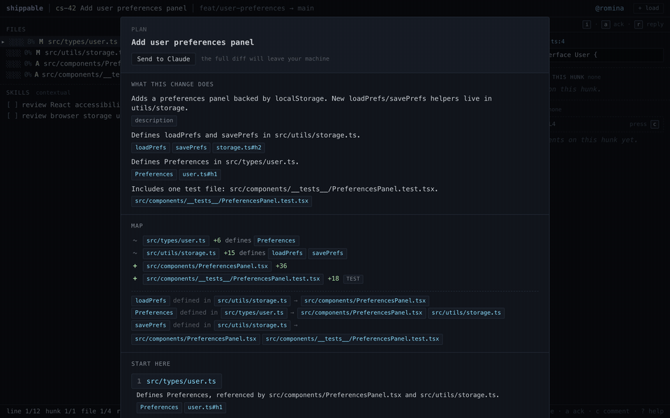

# AI-generated review plan



When you open a ChangeSet, the plan overlay tells you what the diff is doing and where to start reading. The headline and the file/symbol map are computed from the diff itself — no model involved. The intent claims and the entry points are generated by an AI.

Right now the only backend wired up is Anthropic's Claude API. But nothing about the request/response shape between the React app and the server is Anthropic-specific; the idea is that you could swap out the AI adapters easily.

The goal (eventually) is running different providers in parallel on the same diff and merging what they find. Different models notice different things. If two of them independently say "this PR adds rate limiting" and both can point to the code that does it, you trust that claim more. If only one model said something and it can't point to anything real in the diff, the server may drop it or de-emphasize it. So combining models gives you a richer plan with (hopefully?) fewer hallucinations, not just more output.

## What's in a plan

- **Headline** — verbatim from `ChangeSet.title`. Not generated.
- **Structure map** — the file/symbol graph for the diff: which files changed, which symbols are defined, which other files in the same diff reference them. Pure functions over the ChangeSet.
- **Intent** — 2–5 sentences describing what the diff does and why. Each one carries evidence pointing back into the diff. Generated by the model.
- **Entry points** — up to 3 places to start reading, optionally with a specific hunk. Each one has a reason that also carries evidence. Generated by the model.

The headline and the structure map don't need a language model — they're either author-provided or mechanical. Only the parts that need judgment ("what is this PR doing", "where should I start") get sent to a model.

## Request flow

```
React app                    Node server                    Provider (today: Anthropic)
─────────                    ───────────                    ─────────────────────────────
usePlan(cs)
  └─ POST /api/plan
     { changeset: ChangeSet }
                       ─────▶ buildStructureMap(cs)        (no model)
                              prompt = system + map + diff
                              provider.generatePlan({
                                schema: PlanResponseSchema
                              })                            ─────▶ model
                                                            ◀───── { intent, entryPoints }
                              validate evidence refs
                              against the ChangeSet
                              ◀──── { plan: ReviewPlan }
overlay swaps
rule plan → AI plan
```

The frontend never talks to a model directly. The server is the only place that holds API keys.

## What's not Anthropic-specific

Three things in the current code already work the same way for any provider:

**The shape of the response.** The server hands the provider a Zod schema (`PlanResponseSchema`) and asks for a value matching it. Most modern AI APIs support this kind of structured output — Anthropic, OpenAI, Gemini all have it. Each provider adapter just translates the same Zod schema into whatever JSON Schema format that provider expects.

**Evidence validation.** Every claim a model returns has to point back at something real — a file path, a hunk id, a symbol name. The server checks each pointer against the ChangeSet and drops the ones that don't resolve. This is structural validation, not model-specific. It also gives you a useful filter before merging multiple models' outputs: a claim with broken evidence doesn't get to vote.

**The prompt itself.** The system prompt explains the task and the evidence rules. Nothing in it is Anthropic-specific. The provider-specific bits (cache headers, structured-output flags) live in the adapter.

## What would need to change for multiple providers

Today there's a single function `generatePlan(cs)` that calls Anthropic. To get to multi-provider:

- Pull out a `PlanProvider` interface with one method, move the Anthropic code into `providers/anthropic.ts`, add `providers/openai.ts` etc.
- Add a config-driven registry — `PROVIDERS=anthropic,openai` from env, instantiated at startup.
- In `POST /api/plan`, fan out to every configured provider in parallel, validate each response, then merge them into a single `ReviewPlan`. The merge is where you decide things like "claims that 2+ models surface get ranked higher" or "show entry points from all models, deduped".
- Each provider gets its own Keychain entry (`anthropic-key`, `openai-key`, etc.).
- The frontend doesn't really need to change — it still gets one merged plan back. The optional bit is showing which models contributed to each claim, with a small chip or hover, for transparency.

The rule-based plan stays as the fallback regardless of how many providers are configured.

## Current implementation (Anthropic / Claude)

For the prototype, `server/src/plan.ts` calls Anthropic directly:

- **Model** — `claude-sonnet-4-6` by default, override with `CLAUDE_MODEL`.
- **Structured output** — `client.messages.parse()` with `zodOutputFormat(PlanResponseSchema)`. The SDK constrains Claude's response to JSON matching the schema; we get a typed `parsed_output` back, no `JSON.parse`. If the model can't produce a matching response (rare), `parsed_output` is null and the server returns 502.
- **Caching** — the system prompt is the same on every request, so it's marked `cache_control: { type: "ephemeral" }`. First request writes the cache, subsequent ones hit it (cheaper and faster). The variable parts (structure map and diff) sit after the cached prefix.
- **Auth** — `ANTHROPIC_API_KEY` from the environment, read out of macOS Keychain (see the README).

When another provider gets added, only the caching bit is provider-specific (each API has its own caching mechanism). Everything else is a one-to-one translation.

## Evidence refs

Four kinds, any claim can mix them:

| Kind | What it points at |
|---|---|
| `description` | The PR description text |
| `file` | A file in the diff, by `path` |
| `hunk` | A hunk in the diff, by `hunkId` |
| `symbol` | A symbol from the structure map, by `name` + `definedIn` |

Models hallucinate, so we check every ref against the ChangeSet before returning anything. If a ref points at a file, hunk, or symbol that isn't there, we throw it out. If that leaves a claim with no refs at all, the claim goes too. Same for entry points: no `fileId` in the diff means we skip the entry; a stale `hunkId` but valid `fileId` means we keep the file and forget the hunk.

The UI refuses to render a claim without evidence, so anything you see on screen is something you can click through to. No dead citations.

## Fallback

If the server is down, the API errors, the model refuses, or the parsed output is null, the React hook falls back to the rule-based plan in `web/src/plan.ts`. The overlay shows a small status line ("AI plan failed — showing rule-based fallback: …") so it's clear which one you're looking at.

This means the app works without an API key. AI is opt-in.

## Files of interest

- `server/src/plan.ts` — prompt, Zod schema, the Anthropic call, the evidence validator. This is the file to refactor when adding a second provider.
- `server/src/index.ts` — the `POST /api/plan` HTTP handler.
- `web/src/usePlan.ts` — the React hook with loading and fallback states.
- `web/src/plan.ts` — the rule-based plan, used both as the fallback and as the source of `buildStructureMap` (the server imports it directly).
- `web/src/types.ts` — `ReviewPlan`, `Claim`, `EvidenceRef`. The shared contract between front and back.
