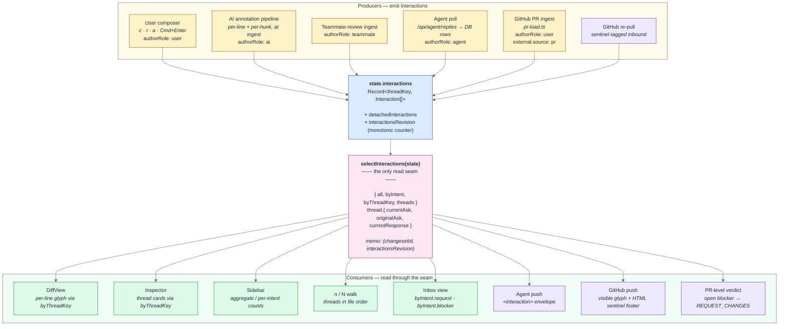
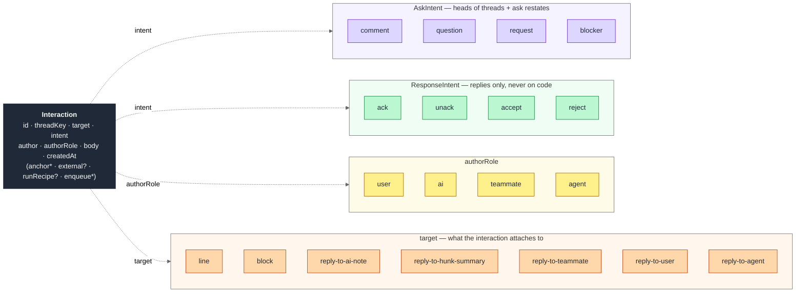

# Architecture

A snapshot of how the code is laid out, alongside `docs/overview.md`.

## Packages

- `web/` — React + Vite, Node 22, TypeScript. Four HTML entry points: `/` (live app), `/gallery.html` (screen catalog driven by canned fixtures), `/demo.html` (scripted demo route), `/feature-docs.html` (per-feature fixture viewer). The live app also accepts `?cs=<id>` to jump to a sample ChangeSet.
- `server/` — tiny Node http server, `tsx watch` in dev. **Required** in every deployment shape: hosts worktree ingest, the prompt library, the streaming review, and the AI plan. The web app refuses to load if `/api/health` doesn't respond.
- `src-tauri/` — Tauri 2 shell. Wraps the web app for the desktop build. The server is compiled to a standalone binary via `bun build --compile` and bundled as a sidecar.
- `library/prompts/` — markdown prompts (`explain-this-hunk`, `security-review`, `suggest-tests`, `summarise-for-pr`).

## Backend endpoints (`server/src/index.ts`)

- `POST /api/plan` — `{ changeset } → { plan }`. Default model `claude-sonnet-4-6`.
- `POST /api/review` — streams a review. Per-IP rate limit, default 30/60s.
- `GET  /api/library/prompts` — list prompts.
- `POST /api/library/refresh` — gated by `SHIPPABLE_ADMIN_TOKEN` (or `SHIPPABLE_DEV_MODE=1`).
- `GET  /api/definition/capabilities`, `POST /api/definition` — TS/JS via `typescript-language-server`, PHP via `intelephense`/`phpactor`. Per-language module shape in `server/src/languages/`; shared `LspClient` lives in `server/src/lspClient.ts`.
- `POST /api/code-graph` — derives diagram edges via real LSP `documentSymbol` + `references`, falling back to the regex builder per language. Implementation in `server/src/codeGraph.ts`; per-file LRU keyed on `(workspaceRoot, ref, language, file, contentHash)`.
- `GET  /api/interactions?changesetId=<id>` — list all interactions for a changeset.
- `POST /api/interactions` — upsert an interaction (creates or updates by id).
- `POST /api/interactions/enqueue` — set `worktree_path` + `agent_queue_status = 'pending'` on an existing interaction row.
- `POST /api/interactions/unenqueue` — clear `agent_queue_status` on an interaction row.
- `DELETE /api/interactions?id=<id>` — delete an interaction.
- `GET  /api/health` — returns `{ ok: true, db: { status: "ok" | "error", error?: string } }`. `db.status: "error"` triggers a hard-fail boot gate in `ServerHealthGate`.
- Origin allowlist with explicit handling of opaque origins (`Origin: null`) and `Sec-Fetch-Site`. The "null"-origin case has bitten us before; see comment in source.

## Credential flow

One pattern serves the Anthropic API key and per-host GitHub PATs:

- **Tauri Keychain** is the durable store. The Rust shell exposes `keychain_get/set/remove` Tauri commands with a small allowlist (`ANTHROPIC_API_KEY`, `GITHUB_TOKEN:<host>`). The server never reads OS credential storage.
- **Server-side `auth/store.ts`** holds the runtime cache, keyed by a flat string (`anthropic` or `github:<host>`).
- **Web orchestrator (`useCredentials`)** drives a boot rehydrate: it reads Keychain via the Tauri commands and pushes hits to `POST /api/auth/set`. The same hook handles user-initiated rotate / clear from the Settings panel and the reactive GitHub-token modal.
- **Boot prompt** (Anthropic only) appears on first run if the credential is missing and the user hasn't dismissed it; the skip choice persists in `localStorage["shippable:anthropic:skip"]`.
- **Hosted-backend future** (`AGENTS.md` deployment-shape note): the same pattern degrades cleanly — without a Tauri shell, the web app simply has no Keychain hits to push, and the user enters credentials via the Settings panel.

## Core data model (`web/src/types.ts`)

- `ChangeSet` → `DiffFile[]` → `Hunk[]` → `DiffLine[]`. Hunks carry symbol metadata and expand-above/below context. AI annotations and teammate reviews used to ride inline on `DiffLine`/`Hunk`; under the typed-review-interactions migration they ship as `Interaction[]` instead (see § Review interactions).
- `ReviewPlan` = `headline` + `intent: Claim[]` + `StructureMap` + `entryPoints` (max 3). Every claim carries `EvidenceRef[]`. The UI refuses to render a claim with no evidence.
- `ReviewState` tracks: cursor, per-hunk read lines, explicitly reviewed files (Shift+M, single verdict gesture), dismissed guides, active skills, expand levels, line selection, plus `interactions` and `detachedInteractions` (see § Review interactions).
- Persistence: **interactions** live in a server-owned SQLite database (`server/src/db/`), keyed by `changeset_id`, fetched lazily per changeset. **Review progress** (cursor, readLines, reviewedFiles, dismissedGuides, drafts) still goes to localStorage via `persist.ts`.

## Review interactions

One primitive — `Interaction` — replaces every prior per-author shape (`Reply`, `AiNote`, `AgentReply`, `teammateReview`, `ackedNotes`). Every author (user, AI, teammate, agent) emits Interactions; they live in one store, are read through one seam, and travel over one wire envelope. The full design is in `docs/plans/typed-review-interactions.md`; this section is the architectural map.

### Data flow



Key invariants:
- **One store.** `state.interactions: Record<threadKey, Interaction[]>` is canonical for the active session. `DiffLine`/`Hunk` carry no annotation fields; ingest pipelines emit Interactions at load time.
- **Server DB is the persistence layer.** All interactions — user, AI, teammate, agent — persist to the server-owned SQLite `interactions` table. The client upserts ingest-produced interactions on changeset load, then GETs the full set back from `/api/interactions?changesetId=…`. There is no `localStorage` fallback; a DB-unavailable condition hard-fails boot. Persistence is upsert-by-id; every producer supplies a stable id.
- **One seam.** Every consumer — diff glyphs, sidebar count, inbox, agent wire, GitHub push — reads through `selectInteractions`. There is no second read path.
- **Memo invalidation.** `interactionsRevision` increments on every reducer write to `state.interactions`. The seam memoises on `(changesetId, interactionsRevision)`.

### Interaction structure



**Validity rule.** `target ∈ {line, block}` allows asks only — response intents on code are a category error (nothing to respond to). Every `reply-to-*` target allows any intent. Validation lives in three seams: the composer hides invalid combinations, the `ADD_INTERACTION` reducer rejects them, and `server/src/index.ts` rejects malformed wire payloads.

### Thread derivations

Every thread has three derived states the seam computes on read:

- **`originalAsk`** = `thread[0].intent` (always an ask; responses can't start threads).
- **`currentAsk`** = intent of the latest ask-intent entry. Diverges from `originalAsk` when the thread evolves (e.g. `comment` → `request` via a body-less restate).
- **`currentResponse`** = thread-level rollup of the latest non-cancelled response per author. `unack` cancels that author's prior `ack` and drops them out of the rollup; the surviving latest across all authors wins.

Together these answer "is this thread resolved?" without the consumer needing to walk the history.

### Thread-key conventions

Thread keys carry topology (where in the diff) but **not** intent or authorRole — those are per-Interaction fields. Same conventions as today:

- `note:<hunkId>:<lineIdx>` — AI per-line annotation thread.
- `hunkSummary:<hunkId>` — AI per-hunk synthesis thread.
- `teammate:<hunkId>` — teammate review thread.
- `user:<hunkId>:<lineIdx>` — fresh user-started line thread.
- `block:<hunkId>:<lo>-<hi>` — user-started block thread.
- `reply-to-agent` target uses the parent's threadKey (agent responses share their parent's thread).

### Wire envelope (agent ↔ shippable)

```xml
<interaction id="cmt_3f7a91" target="block" intent="request"
             author="@romina" authorRole="user"
             file="server/src/queue.ts" lines="72-79"
             htmlUrl="..."?>
  <!-- body -->
</interaction>
```

`target` carries topology; `intent` carries the typed signal. The agent reads structured intent — no prose parsing.

### GitHub round-trip

- **Push:** visible glyph (`🚧 🔧 ❓ ✓ ✗`) when intent ≠ comment, plus a mandatory HTML-comment sentinel footer (`<!-- sp:v1 intent=… id=… -->`). Sentinel is the parser source-of-truth.
- **Pull:** sentinel present → use the tagged intent; absent → `intent: comment`, body verbatim. No heuristic guessing.
- **PR-level verdict:** ≥1 open thread with `currentAsk: blocker` and no `accept` response → `REQUEST_CHANGES`; otherwise `COMMENT`. `APPROVE` is reserved for an explicit reviewer action.

## Ingest paths

A `ChangeSet` can enter the app five ways:

1. **URL** — paste a `.diff` URL; the server fetches and parses it.
2. **File upload** — drag a `.diff` or `.patch` into LoadModal; parsed client-side.
3. **Paste** — raw unified diff text; parsed client-side.
4. **Worktree** — `POST /api/worktrees/changeset` diffs HEAD against the working tree on disk.
5. **GitHub PR by URL** — paste a PR URL (`https://<host>/<owner>/<repo>/pull/<n>`); the server authenticates with a per-host PAT, fetches diff + metadata + review comments from the GitHub API, and assembles a `ChangeSet` with `prSource` provenance. Worktrees whose branch resolves to an open upstream PR surface an opt-in overlay pill that merges `prSource` and PR comments into the existing local-diff `ChangeSet` without displacing `worktreeSource` — both fields can be set simultaneously. See `docs/sdd/gh-connectivity/spec.md` for the full design.

## In-browser code runner

`web/src/runner/` runs JS/TS and PHP hunks in web workers. AI notes can hand a snippet to the runner for one-click verify.

## UI surfaces

`web/src/components/`: DiffView, Sidebar, Inspector, StatusBar, ReviewPlanView, GuidePrompt, ReplyThread, PromptPicker, PromptEditor, PromptRunsPanel, CodeRunner, CodeText, CopyButton, RichText, Reference, CredentialsPanel, SettingsModal, ServerHealthGate, GitHubTokenModal, LoadModal, HelpOverlay, ThemePicker, SyntaxBlock/Showcase, plus Gallery and Demo (internal — not part of the user-facing product).

## Other front-end modules

Beyond components, the load-bearing modules in `web/src/`:

- `promptRun.ts` + `promptStore.ts` — prompt-run state machine and persistence; what `PromptRunsPanel` renders.
- `symbols.ts` — symbol metadata attached to hunks; basis for the symbol-navigation work tracked in `docs/plan-symbols.md`.
- `feature-docs.tsx` — entry point for `/feature-docs.html`, paired with per-feature markdown under `docs/features/`.
- `parseDiff.ts`, `highlight.ts`, `tokens.ts` — diff parsing and Shiki-based highlighting feeding `DiffView`.
- `codeGraph.ts`, `codeGraphClient.ts` — regex graph builder used as the fallback path; the client wrapper that POSTs to `/api/code-graph` for the LSP-resolved version when a worktree is attached. Demo / paste-load callers stay on the regex path.
- `persist.ts` — localStorage round-trip for review *progress* fields of `ReviewState` (cursor, readLines, reviewedFiles, dismissedGuides, drafts). Interactions are no longer stored here; they live in the server SQLite DB.

## Themes

Light, dark, Dollhouse, Dollhouse Noir.
