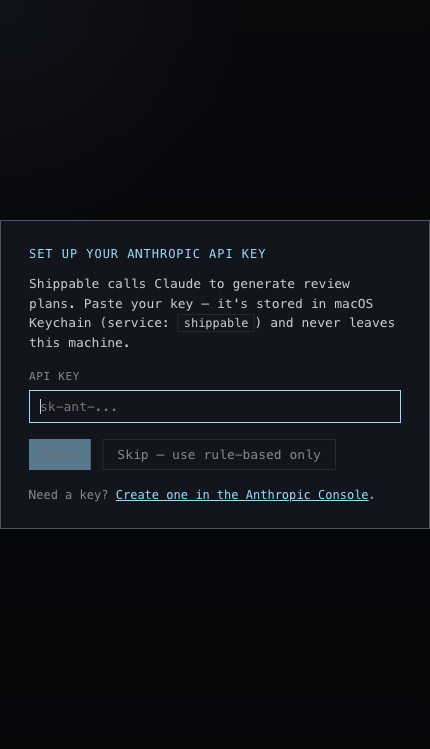
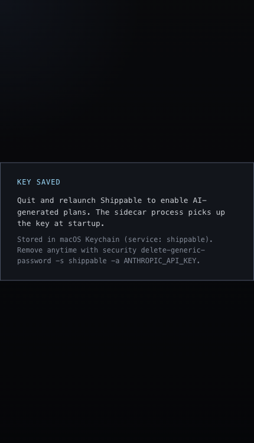

# API Key Setup

## What it is
The desktop-app onboarding flow for enabling AI-backed features.

## What it does
- Prompts for an Anthropic API key when the app does not have one.
- Lets the user skip and stay on rule-based behavior; the bundled server still runs (worktrees, prompt library, rule-based plan) without a key — only the AI-generated plan and streaming review are gated.
- Stores the key in macOS Keychain instead of app-local storage.
- Shows a post-save state that makes the restart requirement explicit.

## Screenshots

