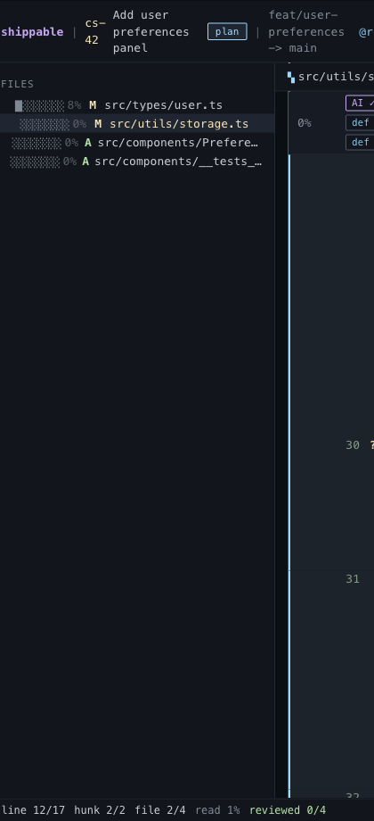

# Block Comments

## What it is
Range-based commenting for multi-line code instead of single-line only.

## What it does
- Uses keyboard selection to mark a contiguous range inside one hunk.
- Shows the selected block in the diff before the comment is written.
- Creates a thread tied to the whole range, not just the cursor line.
- Re-selects the range when the thread is revisited so the reviewer can see what the comment refers to.

## Screenshot

