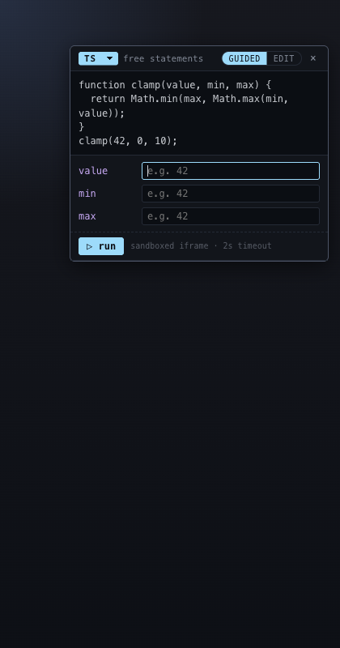
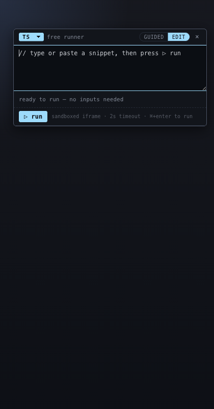

# Code Runner

## What it is
A built-in scratchpad for verifying code paths without leaving the review.

## What it does
- Runs the current hunk or block selection directly from the diff.
- Supports a free runner for one-off snippets that do not come from the patch.
- Handles JS, TS, and PHP.
- Switches between guided mode and raw edit mode.
- Detects input slots and renders a lightweight form instead of making the reviewer rewrite the snippet by hand.

## Screenshots

