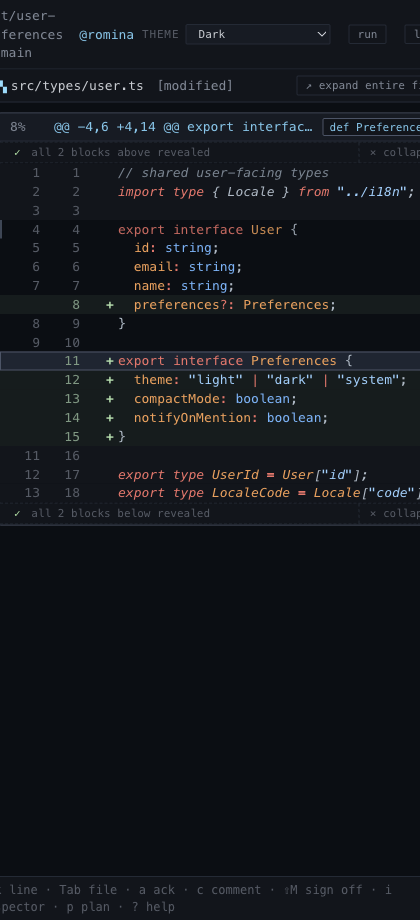

# Context Expansion

## What it is
A scoped way to reveal surrounding code without abandoning hunk mode.

## What it does
- Expands context above or below the current hunk in ordered blocks.
- Reveals the nearest surrounding code first instead of dumping the whole file.
- Shows how much more context is still available before the reviewer expands again.
- Lets the reviewer collapse back to the original hunk view.

## Screenshot

