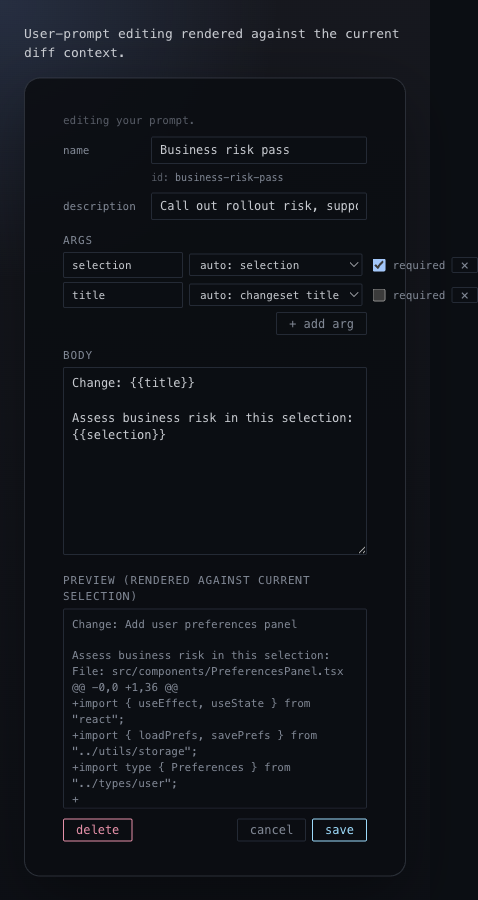

# Custom Prompts

## What it is
User-owned prompt editing on top of the built-in library.

## What it does
- Creates new prompts from scratch.
- Forks library prompts into user prompts instead of mutating the shipped version.
- Edits user prompts in place.
- Supports argument definitions, required flags, and auto-fill hints.
- Shows a live rendered preview against the current selection before the prompt is saved.

## Screenshot

