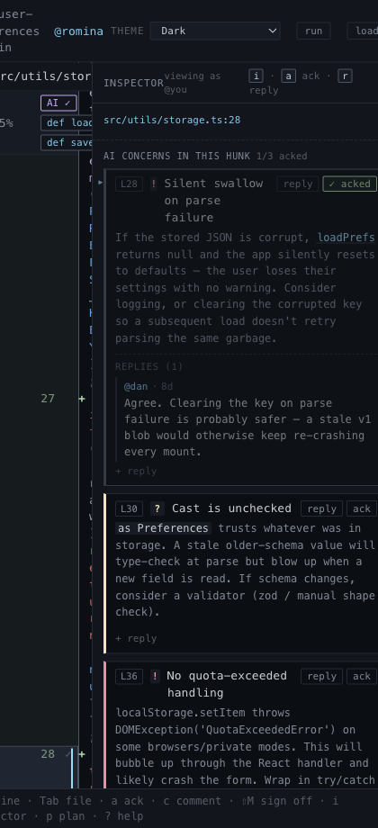

# File Sidebar

## What it is
The left rail for file-level orientation.

## What it does
- Lists every file in the changeset.
- Shows file status with simple `A`, `M`, `D`, and `R` markers.
- Shows read progress as a meter without pretending that read means reviewed.
- Shows explicit sign-off separately with a checkmark and row tint.
- Keeps the current file obvious.
- Lets the reviewer jump files directly instead of scrolling for them.
- Hosts the [prompt-runs panel](./prompt-results.md) above the file list when there are runs in flight.

## Screenshot

