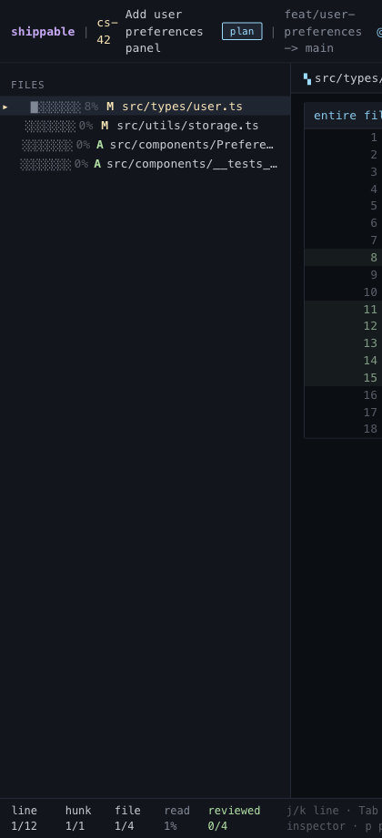

# Full File View

## What it is
A toggle from hunk mode into the full post-change file.

## What it does
- Expands a file from review hunks into one continuous file view.
- Preserves diff signs and line numbers while showing the full file shape.
- Gives the reviewer a way to inspect local structure when hunk boundaries hide too much.
- Collapses back to hunk mode when the broader view is no longer needed.

## Screenshot

