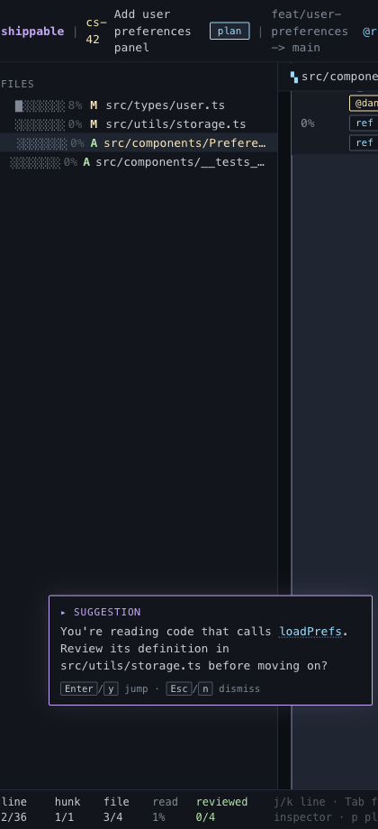

# Guide Suggestions

## What it is
A lightweight nudge when the reviewer is reading code that depends on another unread part of the diff.

## What it does
- Detects when the current hunk references a symbol defined elsewhere in the same changeset.
- Checks whether that definition is still mostly unread.
- Prompts the reviewer to jump to the definition before they lose the thread.
- Supports quick accept or dismiss without opening a separate screen.

## Screenshot

