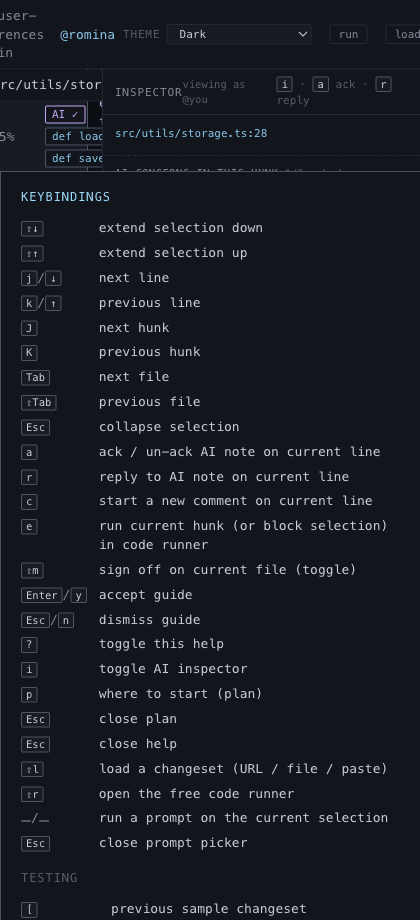

# Keyboard Help

## What it is
An on-demand cheat sheet for the keyboard-first review model.

## What it does
- Documents navigation, review, guide, UI, and testing shortcuts in one overlay.
- Reinforces that the app is meant to be driven without the mouse.
- Gives the reviewer a recovery path when they forget a key and do not want to leave the workflow.

## Screenshot

