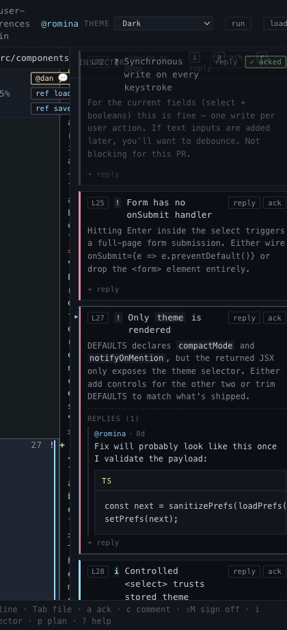

# Line Comments And Replies

## What it is
Threaded discussion on top of any review surface — a diff line, a block selection, an AI note, a teammate verdict, or a hunk summary.

## What it does
- Lets the reviewer reply to anything that lives in the review: an AI note, a teammate verdict, a hunk summary, a prior user comment, or an agent response. The same composer works on every thread.
- Lets the reviewer start their own line comment or block comment thread.
- Keeps existing replies attached to the exact line, block, or note they belong to via stable thread keys.
- Supports draft persistence so closing the composer does not lose in-progress text.
- Lets the reviewer clean up their own reply history if a thread is no longer useful.

## Screenshot

