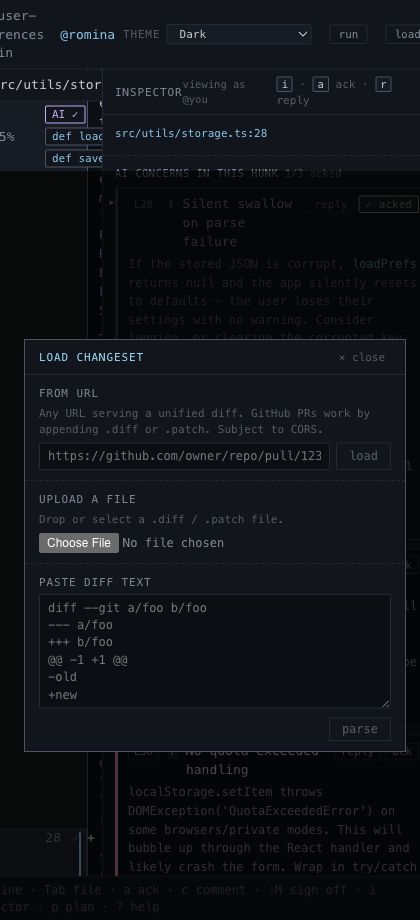

# Load Changeset

## What it is
The ingestion flow for bringing a diff into the app.

## What it does
- Loads a unified diff from a URL.
- Uploads a local `.diff` or `.patch` file.
- Parses pasted diff text directly.
- Explains URL failures instead of failing silently, including the likely CORS case.
- Rejects empty or malformed diffs early.

## Screenshot

