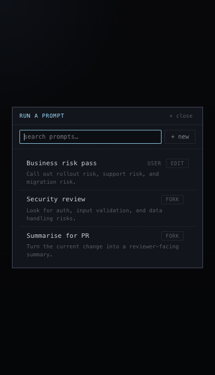

# Prompt Library

## What it is
A picker for reusable review prompts.

## What it does
- Lists built-in and user prompts in one place.
- Supports search instead of making the reviewer remember exact names.
- Shows short descriptions so the reviewer can pick the right prompt quickly.
- Autofills prompt arguments from the current review context when possible.
- Opens the selected prompt as a run-ready form instead of sending it immediately.

## Screenshot

