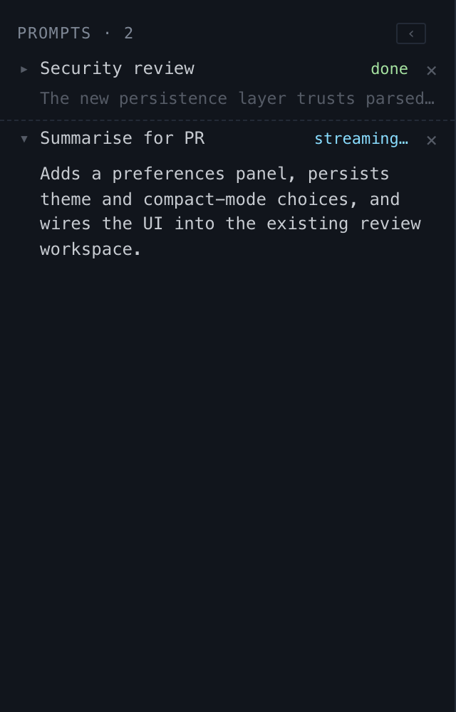

# Prompt Results

## What it is
A panel inside the left sidebar that lists prompt runs. It sits above the file list, hidden when empty.

## What it does
- Streams prompt output as it arrives.
- One row per run, collapsed by default — shows prompt name, status (`streaming…`, `done`, `error`), and a one-line preview of the latest output.
- Click a row to expand it inline; the full streaming text renders inside the sidebar without covering the diff.
- Multiple runs stack one under the other and expand independently. Finished runs stay until the reviewer dismisses them with `×`.
- A `‹ / ›` toggle in the panel header widens the sidebar to 520px so long output has more room. The diff and inspector keep their space.

## Screenshot

