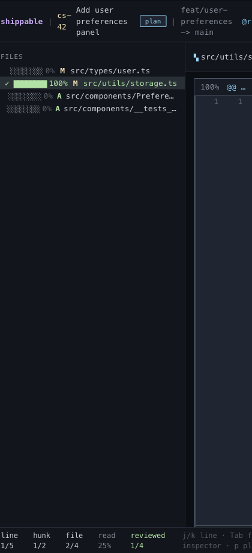

# Session Persistence

## What it is
Local review-state persistence across reloads.

## What it does
- Restores the last cursor position for the current session.
- Restores read marks and explicit file sign-offs.
- Restores dismissed guide suggestions.
- Restores replies and comment drafts.
- Keeps the session local instead of depending on a backend.

## Screenshot

