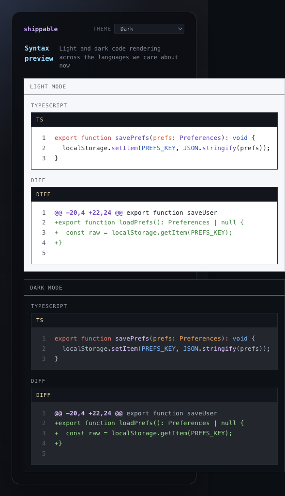

# Themes

## What it is
The UI theme switcher.

## What it does
- Changes the app theme from a simple top-bar control.
- Applies the selected theme to both chrome and code rendering.
- Persists the choice so the app comes back in the same theme next time.

## Screenshot

